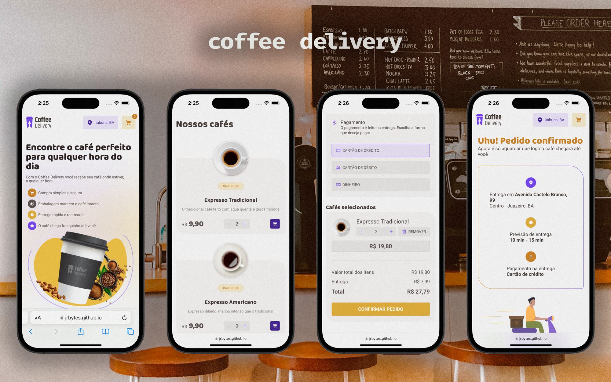

# Coffee Delivery

Projeto feito através de desafio proposto no Ignite da RocketSeat na trilha React 2022. A interface foi disponibilizada em Figma, sendo assim, foi necessário desenvolvimento do layout em React e das funcionalidades baseado no conhecimento do módulo proposto. Esse conteúdo aborda Action Types, responsável pela legibilidade e manutenibilidade do código quando fixa a ação usando um enum do TypeScript.

## Tecnologias

- React
- TypeScript

## Como executar

- Clone o repositório
- Instale as dependências com `npm install`
- Inicie o servidor com `npm run dev`
